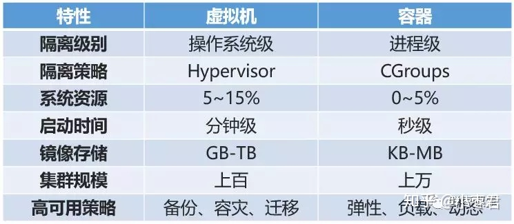
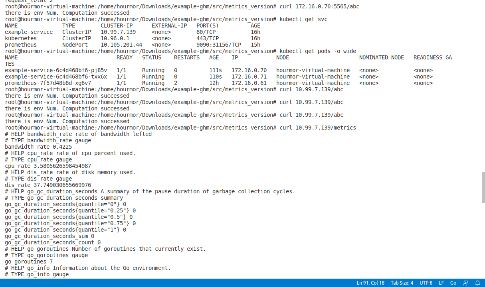
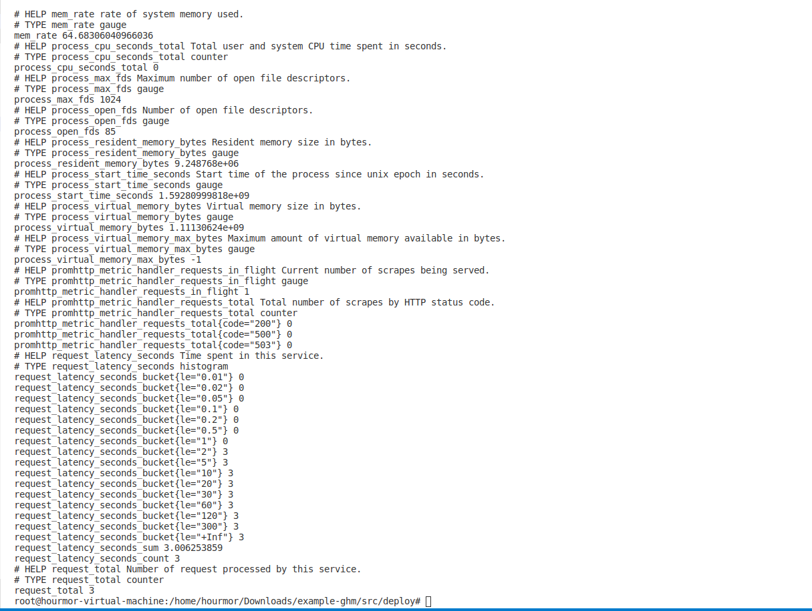
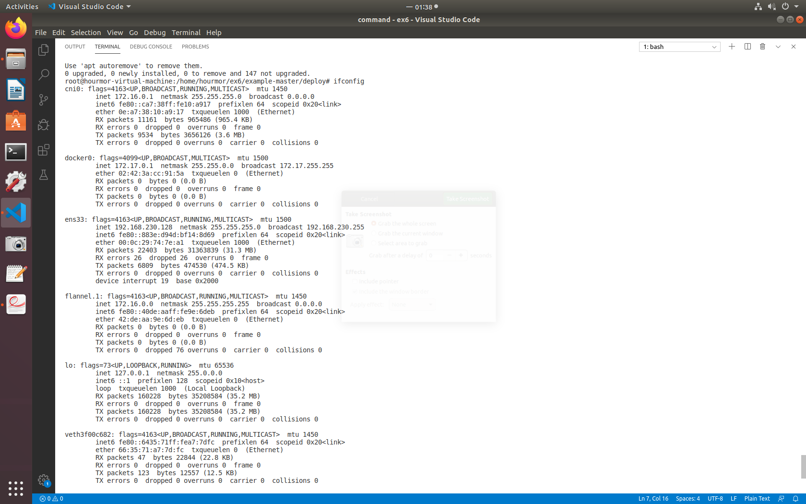
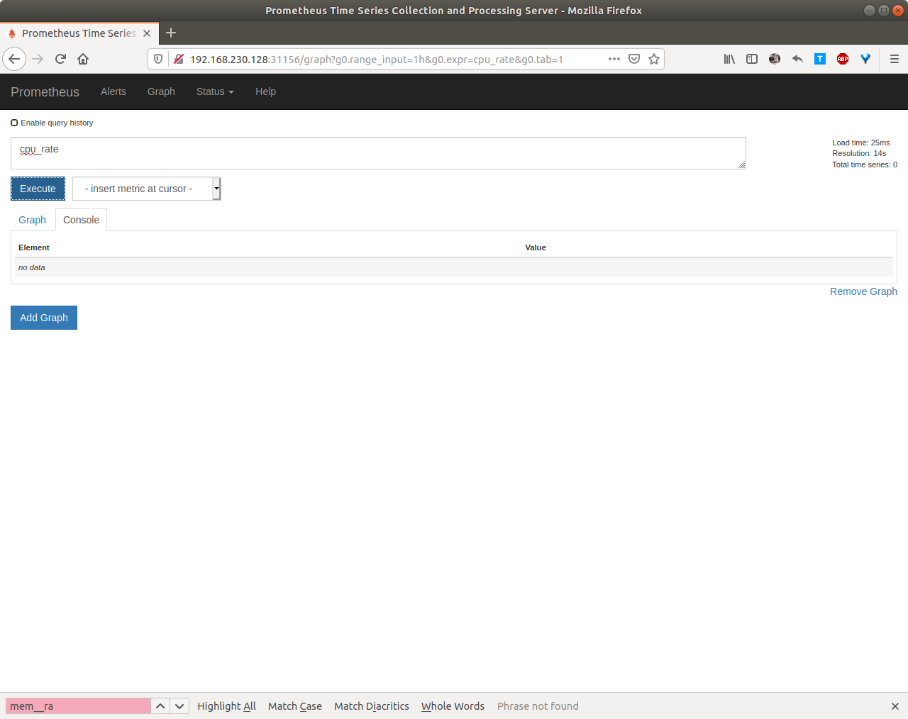
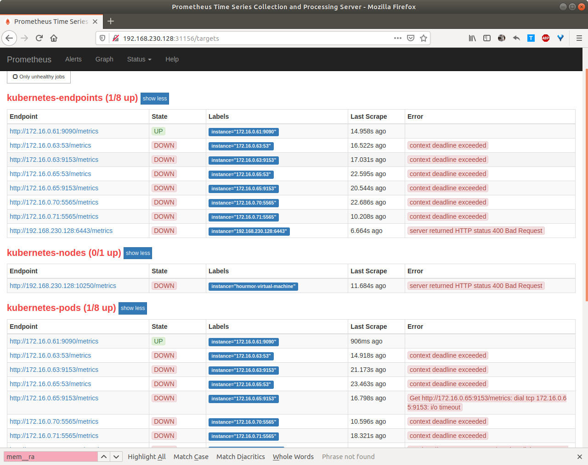

# Report

**作业内容：**
```
提交内容：
0、参考资料的学习笔记（阐述几个问题：什么是镜像？什么是容器？什么是NameSpace？什么是Cgroup？什么是Service？Service有什么用？Prometheus怎么工作的？）
1、自己编写的云应用代码github仓库
2、详细实验过程截图（证明自己的Service配置好了，证明自己的prometheus配置好了，能够拉到metrics了。）
3、README中简单阐述自己的代码逻辑
4、实验感想（可选）

上面的实验的评分逻辑：
0、问题回答是否正确且完整
1、代码注释是否清晰
2、metrics的设计是否合理且丰富
3、截图是否直观
4、README描述是否完整）

加分项（未完成加分项则满分90，加分项一个5分）：
0、截图证明配置了Grafana监控视图，并阐述如何配置
1、阐述Service API对象  对宿主机iptables的操作，截图查看宿主机iptables情况。
```
## 0.学习笔记
1.容器：docker容器就是用来运行镜像的小型的虚拟机，或者说是一个轻量级的沙箱，Docker利用容器来运行和隔离应用。。


2.镜像：类似于虚拟机镜像，镜像是只读的，是创建docker容器的基础。运行中的一个镜像就构成了一格容器。

3.NameSpace:Linux Namespace是Linux内核提供的一种资源隔离方案。处于不同 namespace 的进程拥有独立的全局系统资源，改变一个  namespace 中的系统资源只会影响当前 namespace 里的进程，对其他 namespace 中的进程没有影响。


4.Cgroups:Control Groups 是Linux内核的一个功能，用来限制、控制与分离一个进程组的资源。实现cgroups的主要目的是为不同用户层面的资源管理，提供一个统一化的接口。从单个进程的资源控制到操作系统层面的虚拟化。Cgroups提供了以下四大功能:

- 资源限制（Resource Limitation）：cgroups可以对进程组使用的资源总额进行限制。如设定应用运行时使用内存的上限，一旦超过这个配额就发出OOM（Out of Memory）。
- 优先级分配（Prioritization）：通过分配的CPU时间片数量及硬盘IO带宽大小，实际上就相当于控制了进程运行的优先级。
- 资源统计（Accounting）： cgroups可以统计系统的资源使用量，如CPU使用时长、内存用量等等，这个功能非常适用于计费。
- 进程控制（Control）：cgroups可以对进程组执行挂起、恢复等操作。

5.Services: Service是将运行在一组 [Pods](https://kubernetes.io/docs/concepts/workloads/pods/pod-overview/) 上的应用程序公开为网络服务的抽象方法。Kubernetes `Service` 定义了这样一种抽象：逻辑上的一组 `Pod`，一种可以访问它们的策略 —— 通常称为微服务。 如果需要对应用程序进行访问，实际上是说需要对在某个node，某个pod上的应用程序进行访问，但由于在应用程序的生命周期内，pod可以是不同的，因此需要一个机制对其进行追踪，这就是service的用处。

6.Prometheus:Prometheus 项目工作的核心，是使用 Pull （抓取）的方式去搜集被监控对象的 Metrics 数据（监控指标数据），然后，再把这些数据保存在一个 TSDB （时间序列数据库，比如 OpenTSDB、InfluxDB 等）当中，以便后续可以按照时间进行检索。 Prometheus 剩下的组件就是用来配合这套机制的运行。Metrics 数据指3种数据：
- 宿主机的监控数据
- 来自于 Kubernetes 的 API Server、kubelet 等组件的 /metrics API
- Kubernetes 相关的监控数据

使用pull的方式由于类似一种轮询的机制，相比push方式实际上能降低阻塞的几率，提高可用性。

Prometheus提供了一个集成的规范化显示数据的机制，不必直接查看metrics相关文件。

### reference
https://zhuanlan.zhihu.com/p/53260098

https://www.kubernetes.org.cn/k8s

https://blog.csdn.net/ra681t58cjxsgckj31/article/details/104707642

https://en.wikipedia.org/wiki/Cgroups

https://docs.docker.com/engine/swarm/how-swarm-mode-works/services/

https://kubernetes.io/zh/docs/concepts/services-networking/service/

https://time.geekbang.org/column/article/72281


## 2.实验过程截图

所有pod正常运行



example-service 正常执行&&获取metrics



获取网络配置信息



打开网页进行访问

这里发现实际上filter并没有筛选出关键字。打开发现是example-service在prometheus target对应状态为down。






查找资料。说是config文件配置出错，原因可能有如下

```
    scrape_interval: 5m
    scrape_timeout: 1m
    
-----

 tls_config:
      insecure_skip_verify: true
```

但我都试了，发现并没有如期生效，仍不知道是哪里出现了问题。心累，故放弃。

https://stackoverflow.com/questions/49817558/context-deadline-exceeded-prometheus

https://github.com/prometheus/prometheus/issues/2459

